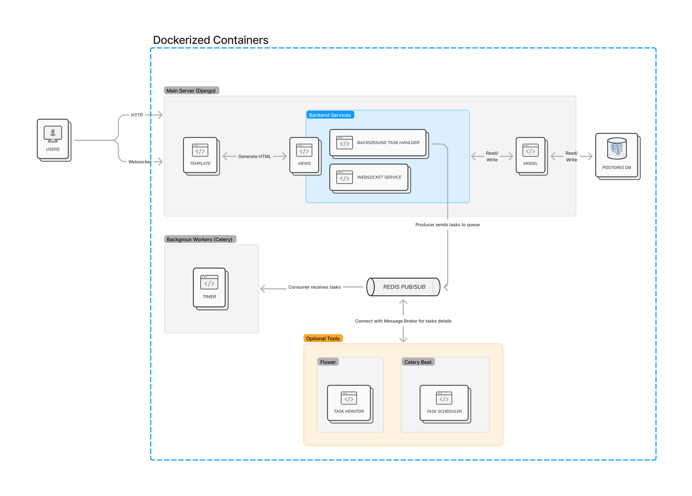

# System Design Document

Argus is a streamlined, efficient platform for conducting and monitoring quiz sessions, designed for seamless user experience and robust performance.

## Architecture Overview

Argus follows a microservices-based architecture, with each component serving a specific function, simplifying deployment, scaling, and maintenance. The design prioritizes efficiency by only including essential tools; optional components, labeled as such, are available to enhance functionality.

### Architecture Diagram

The diagram below represents Argus's architecture, emphasizing simplicity and modularity. Optional components, which provide additional functionalities but are not strictly required, are indicated as such.

## Component Description

### Main Server

The primary server, implemented with **Python and Django**, follows the **Model-View-Template (MVT)** pattern to simplify code organization and enhance maintainability.

- **Responsibilities**:
  - **Database Management**: The server interfaces with PostgreSQL to handle data storage and retrieval. There are two primary tables:
    - **QuizSession**: Tracks each quiz session as a unique object that users can join, view, and monitor.
    - **QuizScore**: Stores scores per user per session, linked to the respective `QuizSession`.
  - **WebSocket Connections**: Leveraging Django Channels, the server supports real-time WebSocket connections for quiz updates and live score tracking.
    - **Channel Layers**: Uses **Redis** as an in-memory database to manage WebSocket routing and connection states.
  - **Template Rendering**: Generates dynamic HTML templates to render user interfaces, including:
    - **Main Room**: Entry point for users to join or create sessions.
    - **Quiz Room**: Displays real-time quiz questions and options.
    - **Monitor**: Shows real-time participant activity for administrators.
    - **Review Page**: Provides detailed post-session statistics and scores.

### Background Workers

Argus employs **Celery** for asynchronous task processing, with Redis as the message broker to facilitate communication between services. These workers run independently of the main server, handling background tasks such as:

- **Timer Management**: Manages countdown timers for quiz questions, ensuring precise time control across user sessions.

### Database: PostgreSQL

Argus utilizes PostgreSQL for persistent data storage.

- **QuizSession Table**: Records each quiz session, including metadata like session name, start time, and active participants.
- **QuizScore Table**: Holds individual scores, linked to specific `QuizSession` instances for organized score tracking.

*Refer to the ER Diagram below for table relationships and data structure overview.*

### In-Memory Database: Redis

Redis serves two main functions in Argus:

- **Channel Layers**: Used by Django Channels to store WebSocket connection routing data, allowing real-time updates without excessive database load.
- **Message Broker**: Facilitates communication between the main server and Celery workers, enabling quick message relay for task execution, particularly for managing timers and handling background tasks.

## Data Flow

The following steps outline the data flow for a typical user interaction within Argus:

1. **Session Creation**: A new session is initiated by a user in the Main Room, and a `QuizSession` entry is created in PostgreSQL.
2. **Real-Time Updates**: As participants join, Channel Layers update WebSocket connections to ensure real-time data sharing.
3. **Question Timer**: Celery manages quiz question timers via Redis, sending periodic updates back to the WebSocket for live display.
4. **Score Tracking**: Each user's response is recorded and stored in `QuizScore`, which is updated dynamically during the session. The Websocket connection will be responsible for transferring user's scores to admin and other users.
5. **Session Completion**: After the quiz, participants are redirected to the Review Page, where scores and statistics are displayed.

This architecture ensures responsive, real-time interaction with minimal latency, providing an engaging and interactive experience for users.

## Technologies and Tools

### Python and Django

- **Reason**: Python's readability and Django's batteries-included framework simplify backend development. Django's MVT pattern helps organize code cleanly, which improves maintainability, while its ORM eases interactions with the database.

### Django Channels

- **Reason**: Django Channels enables real-time functionality using WebSockets, critical for live quiz updates. It integrates well with Django, supporting asynchronous communication while maintaining a consistent framework for both synchronous and asynchronous tasks.

### Celery

- **Reason**: Celery is a powerful asynchronous task manager that allows tasks to run in the background, separate from the main server. This is particularly useful for handling timers in quiz sessions without affecting server performance.

### Redis

- **Reason**: Redis is used for two purposes in Argus:
  - **Channel Layers**: It provides an in-memory data store to manage WebSocket routing, crucial for real-time connections.
  - **Message Broker**: Redis acts as a reliable message broker for Celery, efficiently facilitating communication between the server and background workers.

### PostgreSQL

- **Reason**: PostgreSQL is a robust and powerful SQL database that handles complex queries, which is ideal for storing and retrieving session and score data reliably. Its support for ACID compliance ensures data integrity, which is essential in handling quiz scores.

### Docker

- **Reason**: Docker isolates services (Django, Celery, Redis, and PostgreSQL) into individual containers, allowing for easy scalability, reproducible development environments, and simplified deployment.
